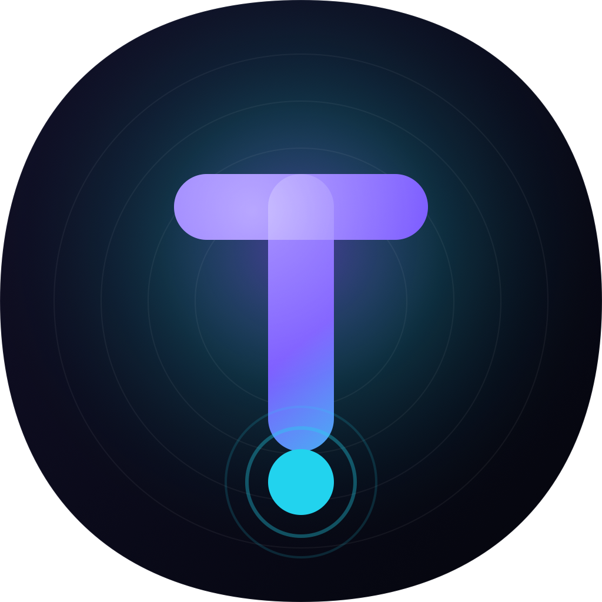
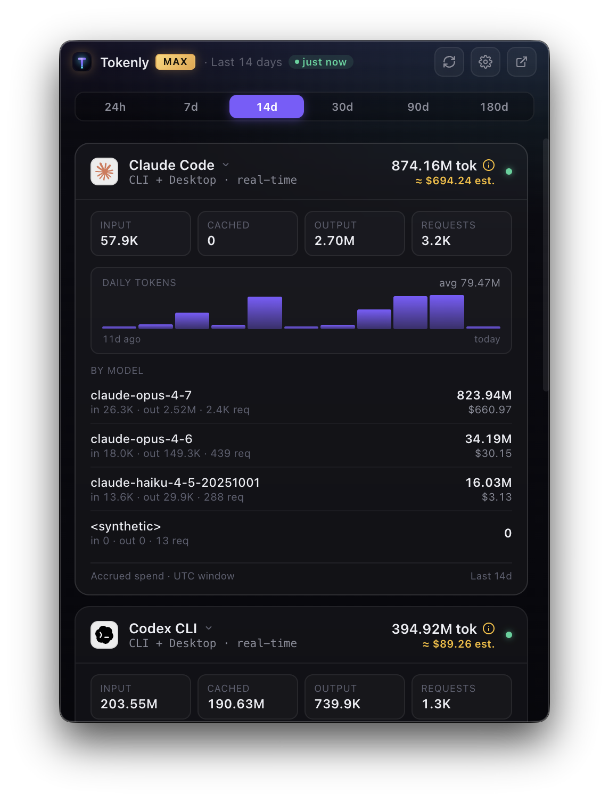
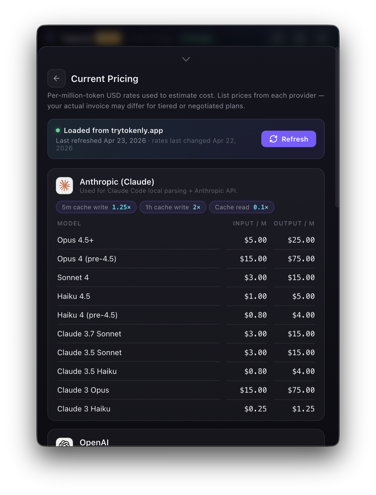
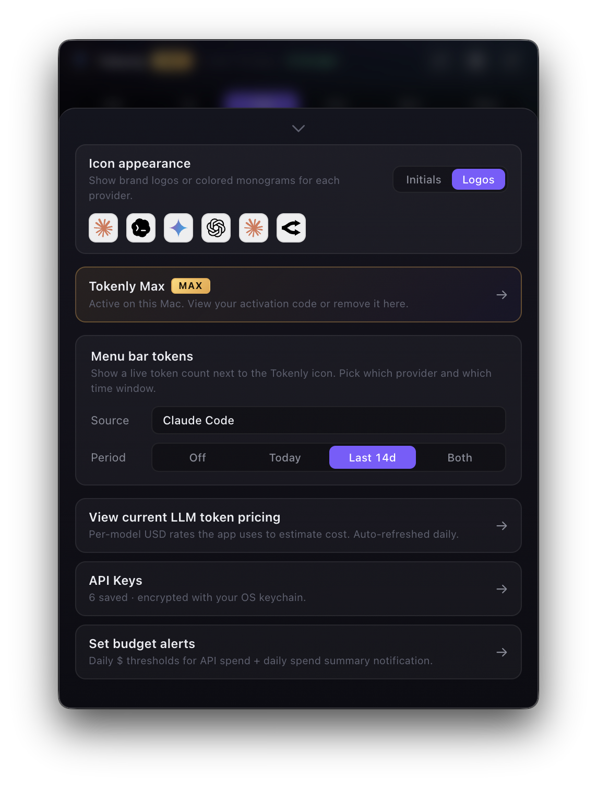
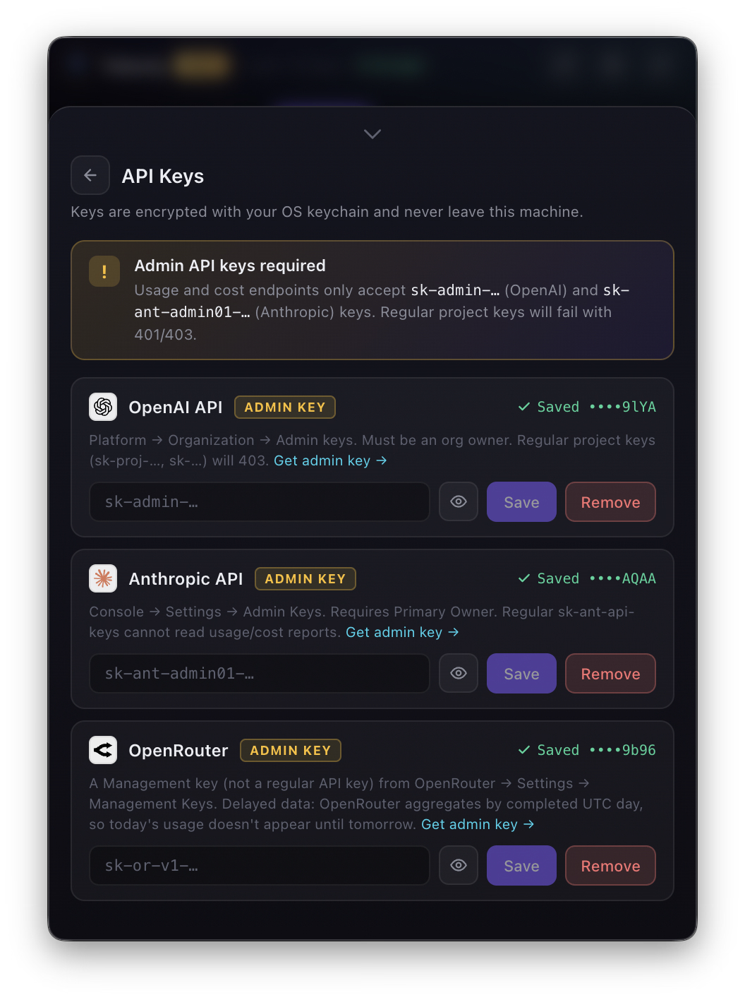

<div align="center">



# Tokenly

**Live monitor for your AI spend — right in your menu bar.**

Every token and dollar your AI tools consume, across six providers, surfaced in real time. Keys stay on your Mac. Setup takes 30 seconds.

[](https://trytokenly.app)
[](https://trytokenly.app)
[](https://github.com/tokenlyapp/tokenly/releases)
[](LICENSE)
[](https://trytokenly.app)

[**Download →**](https://trytokenly.app) &nbsp;•&nbsp; [**How it works**](#how-it-works) &nbsp;•&nbsp; [**FAQ**](#faq) &nbsp;•&nbsp; [**Pricing**](#pricing)

<br />

<table align="center">
  <tr>
    <td align="center" width="50%">
      
      <br /><sub><b>Live dashboard</b> — real-time spend across every provider</sub>
    </td>
    <td align="center" width="50%">
      
      <br /><sub><b>Current pricing</b> — auto-refreshed list prices per model</sub>
    </td>
  </tr>
  <tr>
    <td align="center" width="50%">
      
      <br /><sub><b>Settings</b> — menu-bar display, budgets, and appearance</sub>
    </td>
    <td align="center" width="50%">
      
      <br /><sub><b>API keys</b> — encrypted in the macOS Keychain, never leave your Mac</sub>
    </td>
  </tr>
</table>

</div>

---

## Table of contents

- [What is Tokenly?](#what-is-tokenly)
- [What it tracks](#what-it-tracks)
- [Install in 30 seconds](#install-in-30-seconds)
- [Features](#features)
- [How it works](#how-it-works)
- [Privacy & security](#privacy--security)
- [Pricing](#pricing)
- [System requirements](#system-requirements)
- [FAQ](#faq)
- [Build from source](#build-from-source)
- [Roadmap](#roadmap)
- [Support](#support)

---

## What is Tokenly?

Tokenly is a native macOS menu-bar app that shows you — **live, in real time** — exactly how many tokens you're burning and how much money you're spending across every major AI service you use.

It answers the question every AI-powered developer asks at the end of the month: *"Where did all that money go?"*

Two audiences it was built for:

1. **Subscription users on Claude Max, ChatGPT Team, or Cursor-adjacent tools** — who want to see the ROI of their flat-rate plan in token-equivalents. Would pay-as-you-go have been cheaper?
2. **Teams with OpenAI / Anthropic / OpenRouter admin keys** — who want authoritative per-day spend without waiting for the month-end invoice.

Tokenly serves both. Every card is labeled either **list-price estimate** (amber, tokens-first) or **actual billed spend** (green, dollars-first) so you always know which number is real money.

> **It's a measurement tool, not a gateway.** Tokenly never touches your prompts, your responses, or your API traffic. It reads usage data that already exists on your Mac or queries your provider's own billing endpoints directly. Your keys stay on your device, encrypted via the macOS Keychain.

---

## What it tracks

Six providers, grouped by how they're tracked:

### Local tools (zero setup — no keys, no accounts)

| Provider | What it covers | Source |
|---|---|---|
| **Claude Code** | Claude Code CLI **and** Claude Desktop app | `~/.claude/projects/**/*.jsonl` |
| **Codex** | Codex CLI **and** Codex Desktop | `~/.codex/sessions/**/*.jsonl` |
| **Gemini CLI** | Gemini CLI | `~/.gemini/tmp/<project>/chats/*.json` |

These just work. Install Tokenly, open it, and if you've ever used any of these tools on your Mac, you'll see your full historical usage in seconds.

### API billing (paid plan — one key unlocks accurate spend)

| Provider | What it shows | Key type required |
|---|---|---|
| **OpenAI API** | Per-day token and dollar spend, grouped by model | Admin API key (`sk-admin-…`) |
| **Anthropic API** | Per-day token and dollar spend, grouped by model | Admin key (`sk-ant-admin-…`) |
| **OpenRouter** | Per-day activity **plus** remaining balance (`$X of $Y left`) | Management key |

Keys are encrypted with macOS `safeStorage` (Keychain-backed AES) the moment you paste them, and only the signed Tokenly binary can decrypt them. The keys never leave your device.

---

## Install in 30 seconds

1. **Download** the latest DMG from [trytokenly.app](https://trytokenly.app) or from [Releases](https://github.com/tokenlyapp/tokenly/releases).
2. **Drag** Tokenly into `/Applications`.
3. **Open** it — a small **T** icon appears in your menu bar.
4. Click the icon. Your Claude Code, Codex, and Gemini CLI usage populates **immediately**.

That's it. No signup, no configuration, no telemetry. If you want to unlock API-side tracking, paste an admin key in Settings and it starts polling.

```
 ┌────────────────────────────────────────────┐
 │  Menu bar:                                 │
 │         •  •  •   🔔  🔋   T 142.8k  ⌚︎     │  ← always-on live token count
 │                             ^               │
 │                             └─ Tokenly      │
 └────────────────────────────────────────────┘
```

---

## Features

### The essentials

- **Live menu-bar counter** — today's tokens (or dollars) always visible. Click the tray icon for the full dashboard.
- **Two display modes** — frameless popover under the tray icon (default) or a detachable desktop window you can dock anywhere.
- **Six provider cards** — collapsible, color-coded by family, each showing totals, per-model breakdown, and a 6-range period picker (1d / 7d / 30d / 60d / 90d / 180d).
- **Sub-second refresh** — `fs.watch` on local log directories means a new Claude turn lights up the card within moments of the assistant finishing.
- **Freshness badge** — live-ticking "just now / 8s ago / 2m ago" so you always know how stale the number is.
- **Token + dollar toggle** — switch every card between tokens-first and dollars-first with one click.

### Built for accuracy

- **Live pricing refresh** — rates are fetched from a hosted table at `trytokenly.app/pricing.json` on launch and every 24 hours, disk-cached for offline use, with a bundled fallback. When Anthropic or OpenAI changes a model price, you get the update within hours — no app rebuild required.
- **Cache-aware math** — Anthropic's 5m/1h cache-write multipliers (1.25× / 2×) and cache-read discount (0.1×), OpenAI's cached-input rate, reasoning tokens priced as output — all handled correctly.
- **Admin endpoints only** — API cards use the official org-level billing endpoints, not scraped estimates. If it shows up on your invoice, it shows up here.
- **Dedup by message ID** — local log files can overlap across sessions; Tokenly dedupes so you never double-count a turn.

### Budget alerts *(Tokenly Max)*

- **Per-provider and overall daily budgets** — set in Settings, persisted locally.
- **Three-stage notifications** — native macOS alerts at 50% / 80% / 100% of your daily budget, once per threshold per UTC day.
- **Daily spend summary** — one notification at your chosen local hour (default 5 pm) summarizing the day's burn across every provider.
- **Stateful ledger** — alerts are deduplicated via `~/Library/Application Support/Tokenly/alerts.json` so you never get spammed.

### Power-user touches

- **OpenRouter remaining-balance strip** — green ⚡ bar on the OpenRouter card showing `$X of $Y left`.
- **Codex rate-limit quota strip** — `5h 32% / 7d 67% / team` pulled live from Codex's rollout events.
- **Per-project breakdown** *(roadmap)* — group Claude Code spend by working directory for consultants and freelancers.
- **Tray source + period selector** — pick which single provider (or "All") and which period ("Today", "Last 7d", etc.) feeds the menu-bar counter.
- **Logo / monogram badge toggle** — in Settings → Appearance, swap brand SVG logos for colored initials. Your call.
- **Auto-update** — every installed Tokenly ≥ 1.2.1 polls GitHub Releases every 4 hours, downloads silently, prompts to install. No reinstalls, no reconfiguration.

---

## How it works

Three independent pieces, intentionally decoupled:

```
┌──────────────────────┐     ┌──────────────────────┐     ┌──────────────────────┐
│   macOS Desktop App  │     │   Marketing Site     │     │  Checkout + Delivery │
│   (this repo)        │     │   (Netlify static)   │     │  (Netlify Edge Fn)   │
│                      │     │                      │     │                      │
│ • Tray + popover     │     │ • trytokenly.app     │     │ • Stripe session     │
│ • Local JSONL parser │     │ • Live preview demo  │     │   verification       │
│ • Admin API fetchers │     │ • Pricing + FAQ      │     │ • DMG streamed from  │
│ • safeStorage keys   │     │ • Download gateway   │     │   Netlify Blobs      │
└──────────────────────┘     └──────────────────────┘     └──────────────────────┘
```

**The app talks to providers directly. The site never sees a user's API keys. The Edge Function only handles DMG delivery.**

### Data flow inside the app

```
             Tray icon created (template PNG, auto-tinted by macOS)
                                 │
                                 ▼
                  Popover window (hidden, 460×640)
                                 │
                                 ▼
              Renderer boots React → App.jsx mounts → refreshAll()
                                 │
                 ┌───────────────┴───────────────┐
                 ▼                               ▼
        Load encrypted keys             Fetch usage for each provider
        (safeStorage decrypt)           • claude-code → stream local JSONL
                                        • codex      → stream local JSONL
                                        • gemini     → read JSON sessions
                                        • openai     → /v1/organization/usage
                                        • anthropic  → /v1/organizations/usage_report
                                        • openrouter → /api/v1/activity + /credits
                                 │
                                 ▼
               Results cached 8s in-memory; concurrent requests coalesced
                                 │
                                 ▼
                      Render cards → menu-bar tag updates
                                 │
                                 ▼
              fs.watch → 5s debounce → refresh on new activity
              Auto-poll every 30s (60s for long ranges)
              Paused when window is hidden
```

### Stability layers

Tokenly has to tolerate the "while Claude writes to disk, we're watching Claude write to disk" feedback loop. The stack:

1. Main-process cache (8 s TTL) — repeat `(provider, days)` calls return cached value.
2. In-flight coalescing — concurrent identical fetches share one promise.
3. Renderer version counter — stale results from prior ranges are silently dropped.
4. Structural-equality short-circuit — identical payloads skip React re-renders entirely.
5. Debounced `fs.watch` — bursts collapse to one refresh per 5 s window.
6. Visibility-gated polling — no polls run while the window is hidden.
7. 2 GB file size cap — pathological rollout files are skipped, not attempted.
8. Streaming file reads — memory stays flat regardless of file size (one user had a 1.1 GB Codex rollout).

### Tech stack

- **Electron 33** — runtime, universal binary (Apple Silicon + Intel)
- **React 18 + Babel Standalone** — UI, compiled at runtime in the renderer so iteration is zero-build
- **macOS `safeStorage`** — Keychain-backed AES encryption for API keys
- **macOS `fs.watch`** — recursive watchers for local providers
- **No native modules** — kept packaging simple and code-signing painless
- **`electron-updater`** — silent background updates via GitHub Releases

---

## Privacy & security

This is the part every Tokenly user asks about. Short answers:

| Question | Answer |
|---|---|
| Does Tokenly send my prompts or responses anywhere? | **No.** It never reads prompt or response text. It reads only usage counters from logs (`input_tokens`, `output_tokens`, `model`, `timestamp`) and provider billing endpoints. |
| Does Tokenly send my API keys anywhere? | **No.** Keys are encrypted with `safeStorage` the moment you paste them. Only the signed Tokenly binary can decrypt. HTTPS calls go directly to the provider. |
| Does Tokenly phone home? | **No telemetry, no analytics, no crash reporting.** The only network calls the app makes are: (a) to the six AI providers you configured, (b) to `trytokenly.app/pricing.json` for rate updates, (c) to GitHub Releases for auto-updates. |
| Is the source auditable? | **Yes.** This repo is public. Every provider fetcher is in `main.js`. Every IPC surface is in `preload.js`. Every renderer component is in `app/components/`. |
| What happens if I delete the app? | Your encrypted key file at `~/Library/Application Support/Tokenly/keys.enc` stays on disk until you remove it manually. Tokenly has no server-side account, so there's nothing to cancel. |
| Is the binary notarized? | **Yes.** Signed with Apple Developer ID `8D73RDFBU4` (Austin Downey) and notarized by Apple. macOS Gatekeeper accepts it on first launch with no warning dialog. |

### Where Tokenly stores things on your Mac

```
~/Library/Application Support/Tokenly/
├── keys.enc        # AES-encrypted API keys (safeStorage)
├── prefs.json      # Window/display preferences
├── pricing.json    # Cached pricing tables
├── budgets.json    # Your daily budget settings (plain JSON, no secrets)
└── alerts.json     # Alert dedup ledger
```

---

## Pricing

| | **Tokenly Free** | **Tokenly Max** |
|---|---|---|
| **Price** | Free forever | **$5.99** — one-time, lifetime |
| Claude Code (CLI + Desktop) | ✓ | ✓ |
| Codex (CLI + Desktop) | ✓ | ✓ |
| Gemini CLI | ✓ | ✓ |
| Pricing sheet & live rate updates | ✓ | ✓ |
| Auto-update | ✓ | ✓ |
| OpenAI API (org-wide billing) | — | ✓ |
| Anthropic API (org-wide billing) | — | ✓ |
| OpenRouter (activity + balance) | — | ✓ |
| Menu-bar counter for API sources | — | ✓ |
| Budget alerts (50% / 80% / 100%) | — | ✓ |
| Daily spend summary notification | — | ✓ |
| All future API-side features | — | ✓ |

**No subscription, no seat pricing, no usage fees.** One payment, every update for life.

Tokenly Max is activated with a license key you receive by email after checkout. You can re-download from [trytokenly.app/recover](https://trytokenly.app/recover) for a full year if you lose the original email.

[**→ Get Tokenly Max**](https://trytokenly.app)

---

## System requirements

- **macOS 13 (Ventura) or later**
- Apple Silicon **or** Intel — universal binary
- ~100 MB disk space for the app bundle
- Network access (only to your configured providers + GitHub Releases for updates + `trytokenly.app/pricing.json` for rate refreshes)
- For local tracking: any of Claude Code, Codex, or Gemini CLI installed and used on this Mac
- For API tracking: an **admin** or **management** key (not a project key) for the provider you want tracked

---

## FAQ

**Do I need any of the local CLIs installed for Tokenly to work?**
No. If you don't use Claude Code, Codex, or Gemini CLI, those cards just stay empty. Tokenly is still useful with just API keys.

**Does Tokenly work with regular OpenAI or Anthropic project keys?**
No — the usage/cost endpoints require **admin**-scoped keys. For OpenAI that's `sk-admin-…`; for Anthropic it's `sk-ant-admin-…`. OpenRouter requires a management key. Project keys will return 403 and Tokenly will tell you so in the card.

**I'm on a ChatGPT or Claude Max subscription. Does this show my subscription usage?**
**Claude**: yes, via the Claude Code / Claude Desktop card (both write to `~/.claude/projects/`). **ChatGPT**: the desktop app encrypts local conversations at rest since mid-2024, so local extraction isn't possible. Codex CLI/Desktop usage *is* tracked.

**What about Cursor, Windsurf, Antigravity?**
Investigated and declined — see [`ROADMAP.md`](ROADMAP.md) → "Explicitly not shipping." Cursor's local SQLite is opaque and their dashboard is authoritative; Antigravity syncs state to Google's servers and leaves nothing locally parseable. If any of them ship a public consumer usage API, that changes.

**What if a model's price changes?**
Tokenly fetches `trytokenly.app/pricing.json` on launch and every 24 hours. When Anthropic / OpenAI / OpenRouter changes rates, a GitHub Action flags the change, a pull request is opened, and after review the new rates ship to every installed copy within minutes — no app rebuild, no reinstall.

**Does Tokenly track cache tokens correctly?**
Yes. Anthropic 5-minute cache writes are multiplied 1.25×, 1-hour writes 2×, cache reads 0.1×. OpenAI cached input is priced at 0.1×. OpenAI reasoning tokens are already rolled into output tokens — Tokenly does **not** double-count them.

**Is there a Windows or Linux version?**
No, and no plans to build one. Tokenly is deliberately a Mac-native indie tool. Team mode *(on the long roadmap)* would be the point at which cross-platform gets reconsidered.

**How do I uninstall?**
Drag `Tokenly.app` to Trash. Optionally `rm -rf ~/Library/Application\ Support/Tokenly` to clear keys/prefs. Optionally `rm ~/Library/Preferences/app.tokenly.desktop.plist` for window state.

**How do I get help?**
Email [support@trytokenly.app](mailto:support@trytokenly.app). Or open an [issue](https://github.com/tokenlyapp/tokenly/issues).

---

## Build from source

Tokenly is Electron-based and has minimal dependencies. You can clone and run locally in a few commands.

```bash
git clone https://github.com/tokenlyapp/tokenly.git
cd tokenly
npm install
npm start
```

### Package a DMG locally

```bash
npm run dist
# → dist/Tokenly-<version>-universal.dmg
```

### Publish a release *(maintainers only)*

```bash
export GH_TOKEN=<github pat with repo scope>
npm version patch        # or minor / major
npm run dist:publish     # builds + notarizes + uploads to GitHub Releases
```

Requires an Apple Developer ID and notarization credentials set in the environment. See [`build/entitlements.mac.plist`](build/entitlements.mac.plist) for the signing entitlements.

### Project layout

```
.
├── main.js                  Electron main process — tray, windows, IPC, provider fetchers
├── preload.js               Safe IPC bridge (window.api)
├── renderer.js              Renderer boot
├── index.html               React CDN + Babel host
├── app/components/          React UI (App, ProviderCard, SettingsSheet, atoms, tokens)
├── assets/                  Provider brand logos
├── build/                   Icons, tray templates, entitlements
├── scripts/                 Helper scripts
├── PROJECT.md               Complete build record — read before architectural changes
├── ROADMAP.md               Prioritized feature pipeline
└── OPERATIONS.md            Release, infra, and support playbook
```

---

## Roadmap

The full prioritized roadmap lives in [`ROADMAP.md`](ROADMAP.md). Highlights of what's next:

- **Per-project Claude Code breakdown** — group spend by working directory
- **CSV / JSON export** — for finance and expense reconciliation
- **Compare ranges** — "this 30d vs. prior 30d" with sparkline diffs
- **Pricing overrides** — plug in negotiated enterprise rates
- **BYOM custom endpoints** — LiteLLM, Helicone, self-hosted Ollama proxies
- **Floating pinned widget** — frameless always-on-top tile for the permanently-curious
- **macOS launch-at-login** + full keyboard-shortcut coverage

Deliberately **not** on the roadmap: no telemetry, no ChatGPT / Claude.ai cookie scraping, no built-in AI assistant, no Windows/Linux builds, no in-app credit purchases.

---

## Support

- **Website** — [trytokenly.app](https://trytokenly.app)
- **Email** — [support@trytokenly.app](mailto:support@trytokenly.app)
- **Re-download** — [trytokenly.app/recover](https://trytokenly.app/recover) *(Tokenly Max buyers, 365-day window)*
- **Issues** — [github.com/tokenlyapp/tokenly/issues](https://github.com/tokenlyapp/tokenly/issues)
- **Releases** — [github.com/tokenlyapp/tokenly/releases](https://github.com/tokenlyapp/tokenly/releases)

---

## Acknowledgements

Tokenly stands on the shoulders of the teams building the tools it measures. Provider logos are trademarks of their respective owners and are used here purely to identify data sources within the product. Pricing data is sourced from the providers' published rate cards and cross-checked via the [LiteLLM](https://github.com/BerriAI/litellm) community model registry.

---

<div align="center">

**Tokenly** — *Every token and dollar your AI tools consumed, live, in your menu bar.*

[Download](https://trytokenly.app) &nbsp;·&nbsp; [Pricing](#pricing) &nbsp;·&nbsp; [Privacy](#privacy--security) &nbsp;·&nbsp; [Source](https://github.com/tokenlyapp/tokenly)

Keys stay on your Mac.

</div>
